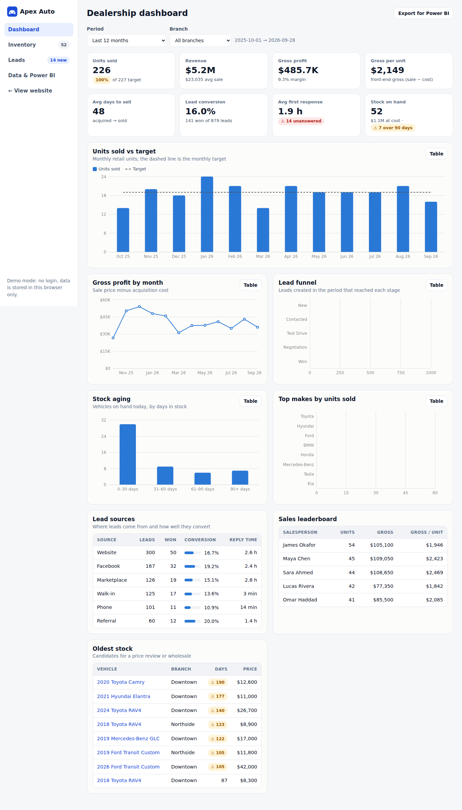
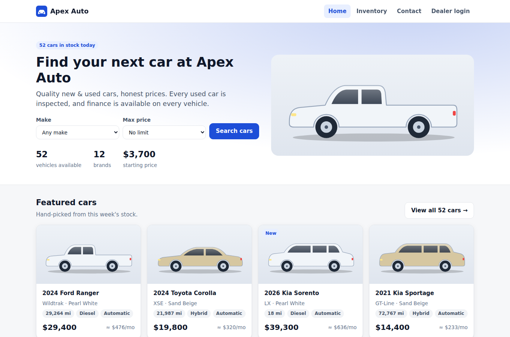
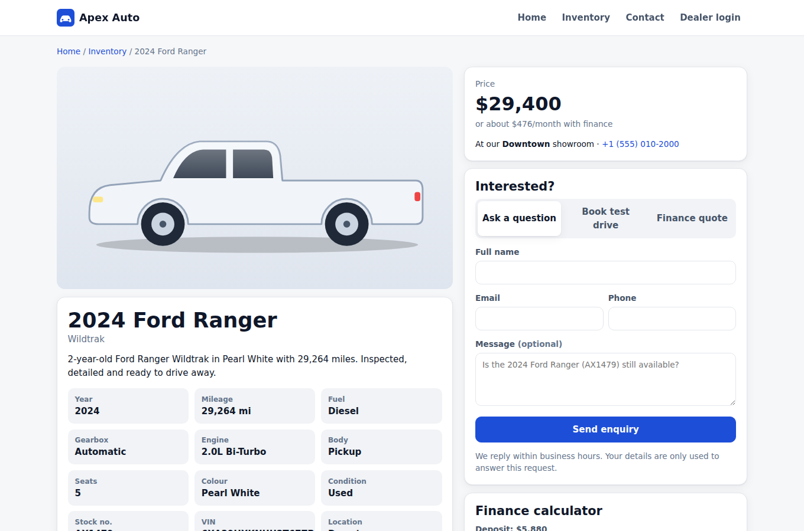
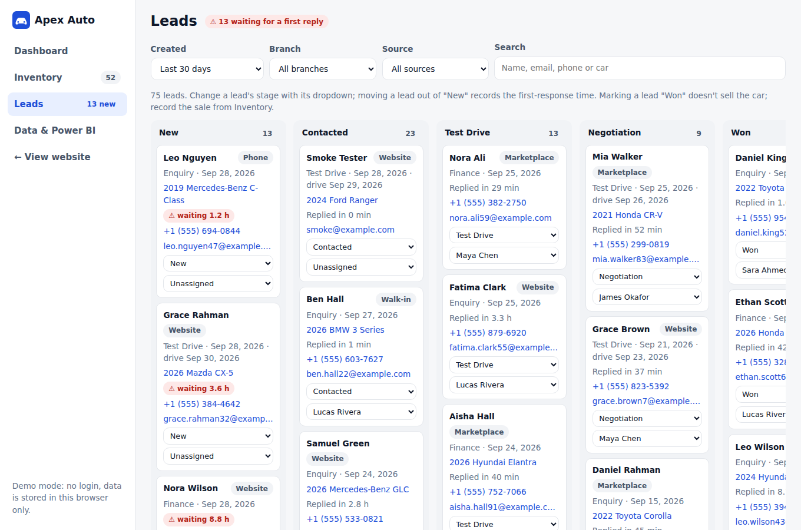
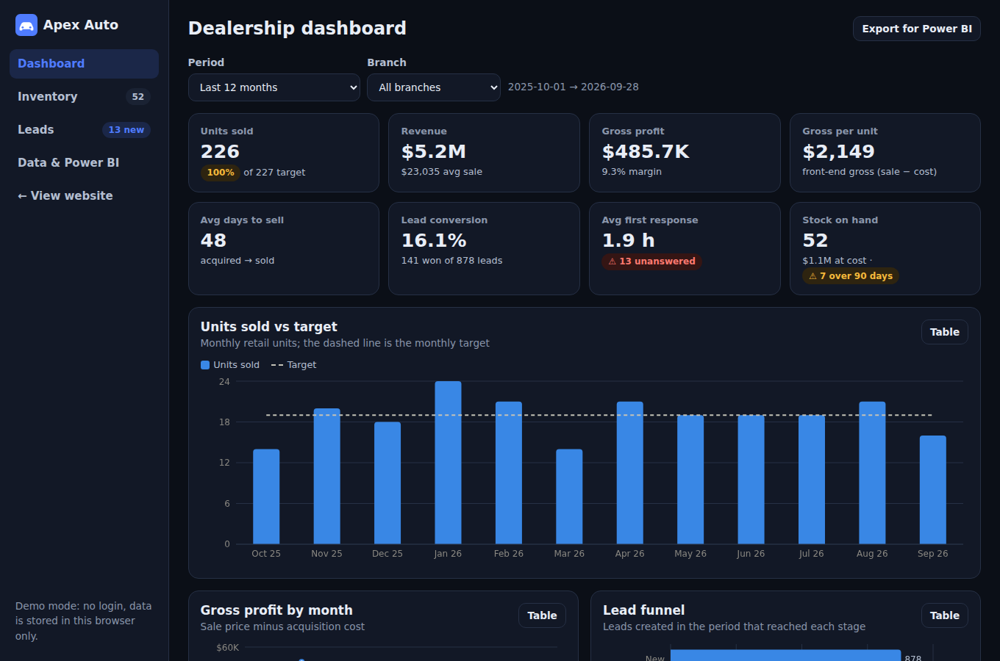
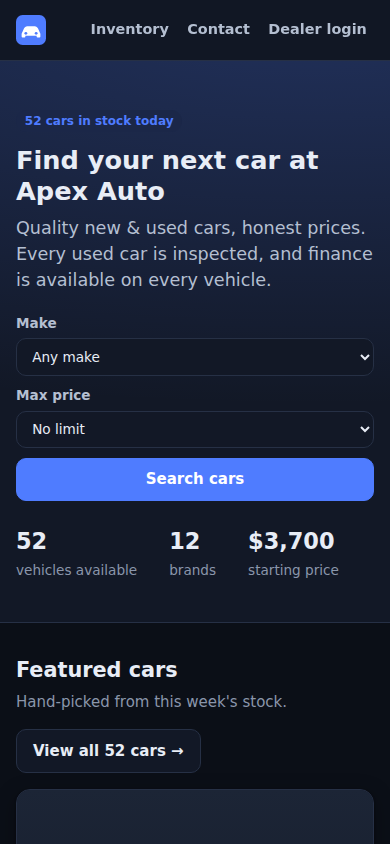

# Apex Auto: car showroom web app + dealership analytics

A full car-dealership demo in one React app:

**Project guide (PDF):** [docs/PROJECT-GUIDE.pdf](docs/PROJECT-GUIDE.pdf) explains what this project is, the business problem it solves, the client's requirements, and how to build it from scratch, step by step.

- **Public showroom**: searchable inventory, vehicle pages, finance calculator, and enquiry and test-drive booking.
- **Dealer back office**: inventory management, a lead pipeline, and a KPI dashboard (sales vs target, gross profit, lead funnel, response times, stock aging).
- **Power BI starter kit**: star-schema CSV exports, 38 DAX measures, a theme, and a step-by-step modelling guide.

It's built from what dealerships actually pay freelancers for: Power BI dealer dashboards, inventory and DMS-style systems, lead tracking, and stock-aging reports.



| Showroom | Vehicle page | Lead pipeline |
|---|---|---|
|  |  |  |

| Dark mode | Mobile |
|---|---|
|  |  |

## Features

### Public website
- Inventory with filters (make, body, fuel, gearbox, condition, branch, price, year, mileage), search and sort. Filters live in the URL, so any search can be shared as a link.
- Vehicle pages with specs, features, similar cars and a finance calculator (deposit, term, APR).
- Enquiry, test-drive and finance-quote forms with validation. Each submission lands in the dealer's lead pipeline.
- Responsive down to phone width, with automatic dark mode.

### Dealer back office (`/#/admin`)
- **Dashboard.** Filter by period and branch. KPIs: units vs target, revenue, gross profit and margin, gross per unit, days to sell, lead conversion, first-response time, unanswered leads, stock value, and stock over 90 days. Charts: units vs target, monthly gross, lead funnel, stock aging and top makes. Every chart has a table view. Tables: lead-source conversion, salesperson leaderboard and oldest stock.
- **Inventory.** Add or edit vehicles (with validation), reserve or unreserve, record a sale (price, date, salesperson, gross preview) and delete.
- **Leads.** A board with six stages. Changing a stage is logged, and the first move out of "New" records the response time. Unanswered leads are flagged with how long they've waited.
- **Data & Power BI.** Download CSVs for Power BI, back up or restore all data as JSON, and reset the demo data.

### Demo data
A seeded generator creates 24 months of realistic history ending today: about 480 vehicles, about 430 sales, about 1,500 leads, 2 branches and 5 salespeople. It includes seasonality, stock aging and slow lead responses, so the dashboard has something to find.

## Tech

React 19, TypeScript, Vite, React Router (hash routing, so it works on any static host) and Recharts. Data is kept in `localStorage`, with no backend. Tests use Vitest (33 unit tests) and a Playwright smoke test that clicks through every page, including phone width and dark mode.

## Run it

```bash
npm install
npm run dev             # http://localhost:5173
npm test                # unit tests
npm run build           # type-check + production build to dist/
npm run smoke           # browser smoke test (after build; needs Chromium)
npm run export:powerbi  # regenerate powerbi/data/*.csv
```

## Deploy

**GitHub Pages:** in the repo, go to Settings → Pages → Source and choose **GitHub Actions**. Every push to `main` then runs tests, builds and publishes the site (`.github/workflows/deploy.yml`).

Any other static host (Netlify, Vercel, Cloudflare Pages) works too: build with `npm run build` and serve `dist/`.

## Customise for a client

Change the branding in `src/config.ts`: dealership name, currency and locale (e.g. `PKR`/`en-PK`, `AED`/`en-AE`), branches, monthly targets, salespeople and finance defaults. Add real photos by setting a vehicle's **Photo URL** in the admin; cars without one show a colour-matched illustration.

## Before using this with real customers

This is a portfolio and demo build. For production it needs:

1. **A backend and database.** Right now data lives in one browser. Move the store (`src/store/store.tsx`) onto Supabase, Firebase or a small API. The data shapes in `src/types.ts` map directly to tables.
2. **Real authentication** for `/admin`. There is no login at the moment, so anyone with the link can open the back office.
3. **Photo uploads** to object storage instead of pasted URLs.
4. **Lead notifications** (email or WhatsApp) when an enquiry arrives.
5. **Optional integrations:** import from a DMS (CDK, Reynolds, Dealertrack) or feed listings to marketplaces.

## Project layout

```
src/
  config.ts            branding, branches, targets, salespeople
  types.ts             data model
  data/                demo data generator + model catalogue
  lib/                 analytics, inventory filters, finance, CSV export (all unit-tested)
  store/               state + localStorage persistence
  components/, pages/  UI (pages/admin = back office)
powerbi/               CSVs, DAX measures, theme, modelling guide
scripts/               Power BI export, browser smoke test
```
